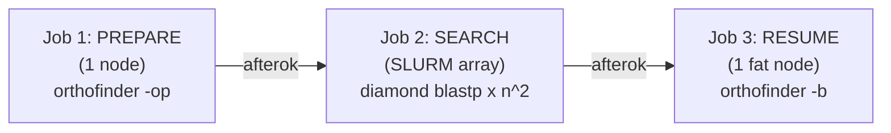

# Multi-node OrthoFinder — Prepare Phase

This document describes **Job 1 of 3** in `convgeno`'s multi-node OrthoFinder
workflow. It is a factual walkthrough of what the prepare job does, in the order
it actually runs. For the load-balancing math and the search array, see
[`search-phase.md`](./search-phase.md).

---

## Where the prepare phase sits

OrthoFinder has no built-in multi-node mode, but it exposes two checkpoints:

- **`-op` (prepare / "orthogroups precompute")** formats the inputs, builds the
  per-species search databases, and **prints every all-vs-all search command to
  stdout, then stops without running any of them.**
- **`-b <WorkingDirectory>` (resume)** picks the run back up from already-computed
  search results and finishes the analysis.

`convgeno` uses these two checkpoints to split the run into three SLURM jobs
chained by dependency:



The prepare job runs on a single node. Its job is to produce, and verify, the
inputs the search array needs, and to write a balanced work plan (the *manifest*)
that tells each array task which searches to run.

Generated script: `slurm_scripts/orthofinder_prepare.sh`
(from `convgeno.slurm.multinode_generator.generate_prepare_script`).

---

## Inputs and outputs at a glance

**Input:** a directory of one protein FASTA per species (`orthofinder.input_dir`).

**Outputs** (written into `OUTPUT_PARENT`, the parent of `orthofinder.output_dir`;
`RUN_NAME` is the basename of `orthofinder.output_dir`):

| File / directory | Contents |
|---|---|
| `<OUTPUT_DIR>/…/WorkingDirectory/` | OrthoFinder's working area (created by `-op`) |
| `WorkingDirectory/SpeciesIDs.txt` | one line `id: filename` per species |
| `WorkingDirectory/Species{i}.fa` | the reformatted proteome for species `i` |
| `WorkingDirectory/diamondDBSpecies{j}.dmnd` | the DIAMOND database for species `j` |
| `<RUN_NAME>_working_dir_path.txt` | one line: the absolute path to `WorkingDirectory` |
| `<RUN_NAME>_diamond_commands.txt` | all commands extracted from `-op` stdout |
| `<RUN_NAME>_db_mode.txt` | `self_built` or `emit_build_commands` |
| `<RUN_NAME>_db_build_commands.txt` | the `makedb` commands (may be empty) |
| `<RUN_NAME>_search_commands.txt` | the `blastp` commands only — exactly `n²` lines |
| `<RUN_NAME>_search_manifests/search_task_{t}.txt` | one manifest per array task |
| `<RUN_NAME>_prepare_full_stdout.log` | the full `-op` stdout, for debugging |

The two files the downstream jobs depend on are
**`<RUN_NAME>_working_dir_path.txt`** (the resume job reads it) and the
**`<RUN_NAME>_search_manifests/` directory** (the search array reads it).

---

## Step-by-step, in execution order

### 1. Resource request (SBATCH header)

The header is sized from the input proteomes at generation time. Let
`total_MB` = combined size of all input FASTAs and `largest_MB` = the single
largest FASTA, both in megabytes.

- **CPUs:** `cpus = min(16, cpus_per_task)`.
- **Memory (MB):**
  `mem = 2048 + 2·total_MB + 4·largest_MB`,
  then raised to at least `4096` and rounded **up** to the next multiple of `1024`.
- **Walltime (seconds):**
  `time = (600 + 3·total_MB) · 1.5`,
  clamped to the range `[1800, 14400]` (30 minutes to 4 hours).

If the inputs cannot be read at generation time, the header falls back to
`4096 MB` and `02:00:00`.

The job requests `--nodes=1` and `--ntasks=1`.

### 2. Environment bootstrap

The script activates the conda environment using absolute paths recorded at
`convgeno init` time (an optional `module load`, then
`source <conda_base>/etc/profile.d/conda.sh`, then
`conda activate <env_prefix>`), so `orthofinder`, `diamond`, and `python` are on
`PATH`.

### 3. Output-directory guard

OrthoFinder refuses to run against an existing `-o` directory. The script
creates only `OUTPUT_PARENT` and aborts if `OUTPUT_DIR` already exists.

### 4. Run OrthoFinder prepare (`-op`)

```
orthofinder -f "$INPUT_DIR" -o "$OUTPUT_DIR" -op -S "$SEARCH_PROGRAM"
```

stdout is captured to `<RUN_NAME>_prepare_full_stdout.log`. This single run **is**
the probe — it creates `WorkingDirectory/` (with `SpeciesIDs.txt`,
`SequenceIDs.txt`, `Species{i}.fa`), builds the DIAMOND databases in this
OrthoFinder version, and prints the search commands to stdout, then exits without
running them. If `-op` returns non-zero the job aborts and prints the log.

### 5. Extract the emitted commands

The commands are pulled out of the log with a regex that matches only real
command lines (a program name — `diamond blastp`, `diamond makedb`, `blastp`, or
`makeblastdb` — immediately followed by a flag), so OrthoFinder's prose header
lines are excluded. Leading whitespace is stripped. The result is written to
`<RUN_NAME>_diamond_commands.txt`. The job aborts if the file is empty or contains
any line that is not a valid command.

### 6. Locate and record the WorkingDirectory

The script finds `WorkingDirectory` under `OUTPUT_DIR` and writes its absolute
path to `<RUN_NAME>_working_dir_path.txt`. The resume job reads this pointer
directly (a missing pointer means prepare failed).

### 7. Determine how databases were handled

Two OrthoFinder behaviours are supported and detected from what `-op` produced:

- **`emit_build_commands`** — `-op` printed `makedb` / `makeblastdb` commands for
  the databases (count `> 0`). The databases do **not** exist yet.
- **`self_built`** — `-op` printed no build commands but the database files
  already exist directly in `WorkingDirectory` (found at depth 1). `-op` built
  them itself during this run.

The detected mode is written to `<RUN_NAME>_db_mode.txt`. If neither signal is
present the job aborts.

> Database-file counting is done at **depth 1 only**. OrthoFinder runs a startup
> self-test that leaves a throwaway database under `WorkingDirectory/dependencies/`;
> counting recursively would include it and overcount by one.

### 8. Split commands into databases vs searches

The extracted commands are split into two files:

- `<RUN_NAME>_db_build_commands.txt` — the `makedb` / `makeblastdb` commands.
- `<RUN_NAME>_search_commands.txt` — the `blastp` search commands **only**.

The search-commands file is the unit of work for the array job, and it contains
one line per ordered species pair.

### 9. Completeness gate — search count

Let `n` = the number of species (the count of active `id:` lines in
`SpeciesIDs.txt`). An all-vs-all search over `n` species is every ordered pair
including self-pairs, so there must be exactly:

```
expected_searches = n²
```

The job asserts that the number of `blastp` commands equals `n²` and **aborts
otherwise**. This catches a truncated or format-changed command list before it
can silently produce fewer searches than the analysis requires.

### 10. Build databases (only in `emit_build_commands` mode)

If `-op` emitted build commands, the job first asserts there are exactly `n` of
them (one per species) and then runs each `makedb` on this node. In `self_built`
mode this step is skipped because the databases already exist.

### 11. Completeness gate — database presence

For a DIAMOND run, the job verifies **by name, at depth 1**, that
`diamondDBSpecies{id}.dmnd` exists for **every** `id` in `SpeciesIDs.txt` — i.e.
exactly `n` per-species databases at the top level of `WorkingDirectory`. It
aborts if any is missing. (For other search programs it checks that the
top-level database files are present.)

### 12. Build the balanced per-task manifest

Finally the job partitions the `n²` search commands into `T` cost-balanced
buckets and writes one manifest file per array task:

```
python -m convgeno.slurm.build_search_manifest \
    --search-commands "<RUN_NAME>_search_commands.txt" \
    --work-dir       "$WORK_DIR" \
    --manifest-dir   "<RUN_NAME>_search_manifests" \
    --tasks          "$SEARCH_TASKS"
```

`SEARCH_TASKS` (`T`) is fixed when the scripts are generated, so the number of
manifests written here always matches the search array's width. The load-
balancing algorithm (the cost model, the `T` value, and how commands are
assigned to buckets) is documented in [`search-phase.md`](./search-phase.md). If
this step fails, the prepare job aborts so the search array is never launched
against a missing or partial work plan.

---

## What the prepare phase guarantees

By the time the prepare job exits successfully:

1. The `WorkingDirectory` exists and its path is recorded.
2. There are exactly `n` per-species search databases, verified by name.
3. There are exactly `n²` `blastp` search commands.
4. Every array task has a manifest listing the commands it must run.

These invariants are what let the downstream jobs trust that the search space is
complete: no species pair is missing, and no database is absent.

## What runs next

On success, the search array (Job 2) starts under an `afterok` dependency and
consumes the manifests and databases produced here. See
[`search-phase.md`](./search-phase.md).
