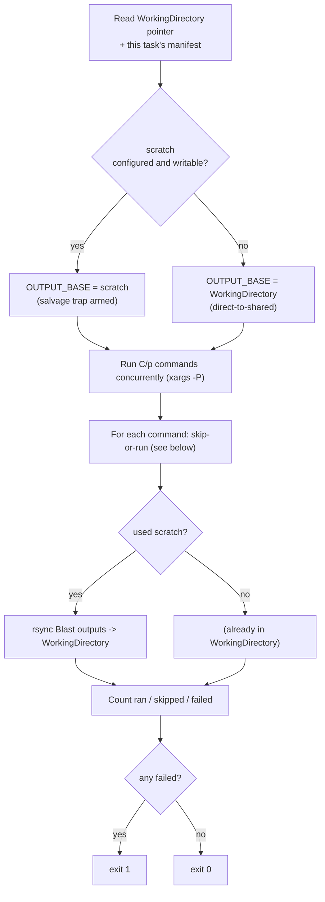

# Multi-node OrthoFinder — Search Phase

This document describes **Job 2 of 3** in `convgeno`'s multi-node OrthoFinder
workflow: how the O(n²) all-vs-all sequence search is distributed across a SLURM
array, load-balanced, and made restartable. It is a factual walkthrough of the
math and the runtime behaviour, in the order things actually happen. For the job
that produces the inputs used here, see [`1-prepare-phase.md`](./1-prepare-phase.md).

---

## Where the search phase sits

The prepare job (Job 1) has already:

- built the `n` per-species DIAMOND databases (`diamondDBSpecies{j}.dmnd`),
- written the `n²` `blastp` commands to `<RUN_NAME>_search_commands.txt`,
- and written one **manifest** per array task under
  `<RUN_NAME>_search_manifests/`.

The search phase runs those `n²` commands. Each search is independent — species
`i`'s proteins searched against species `j`'s database, producing
`Blast{i}_{j}.txt.gz` — so the work is parallel. `convgeno` runs
it as a **SLURM array of `T` tasks**, each task running a balanced share of the
commands. Once every `Blast{i}_{j}.txt.gz` exists, the resume job (Job 3) can
finish the analysis with `orthofinder -b`.

Generated script: `slurm_scripts/orthofinder_search.sh`
(from `convgeno.slurm.multinode_generator.generate_search_array_script`).

Three things happen at three different times:

| When | What |
|---|---|
| **Generation** (login node) | The sizing (C, W, K, T, per-task time/mem) is computed and baked into the script header. |
| **Prepare** (Job 1) | The manifests are written by partitioning the real commands into `T` buckets. |
| **Array runtime** (Job 2) | Each task reads its manifest and runs its commands. |

---

## The cost model

Every quantity below derives from the **proteome sizes**. Let `|Sᵢ|` be the byte
size of `Species{i}.fa` in the `WorkingDirectory`. The estimated cost of the
search of species `i` (query) against species `j` (database) is:

```text
cost(i, j) = |Sᵢ| · |Sⱼ|
```

This is a proxy for `diamond blastp` runtime: both the query volume and the
database volume drive the alignment work, so self-pairs and large×large pairs are
the most expensive. All arithmetic is done in exact integers (`|Sᵢ|·|Sⱼ|` for a
large proteome exceeds the range of exact floating point).

The species pair `(i, j)` for each command is read from the `Blast{i}_{j}` token
in the command's output path — the naming OrthoFinder's resume step depends on —
cross-checked against the `Species{i}.fa` (query) and `diamondDBSpecies{j}`
(database) tokens.

---

## Sizing: C, W, K, T

These four numbers control the shape of the array. `C`, `W`, and `K` come from
cluster discovery and configuration; `T` is derived from them. Any of them can be
pinned in `pipeline_config.yaml` under `multinode:`; otherwise they are
auto-derived.

### C — cores per task

```text
C = min( ⌊max_cpus_per_node / 3⌋ , min_cpus_per_node − 1 ),   clamped to ≥ 1
```

`max_cpus_per_node` and `min_cpus_per_node` are the largest and smallest logical
CPU counts across the partition's nodes. `C` becomes `--cpus-per-task`. Example:
biggest node 52, smallest 15 → `min(17, 14) = 14`.

### W — concurrency (the array throttle)

```text
W = min( configured default (12) , QOS MaxJobs ),   clamped to ≥ 1
```

`W` is the maximum number of array tasks allowed to run at once; it becomes the
`%W` throttle in the `--array` directive. If the partition's QOS advertises a
`MaxJobs` limit, `W` is capped to it (SLURM enforces the QOS at runtime
regardless).

### K — waves

```text
K = configured default (4)
```

`K` is the number of "waves" of `W` tasks. It sets how finely the work is divided.

### T — number of tasks / buckets

```text
T = min( K·W , n² , MaxArraySize ),   clamped to ≥ 1
```

`T = K·W` is the target. It is capped so that it never exceeds the number of
commands (`n²`, or there would be empty tasks) nor SLURM's `MaxArraySize` (or the
array would be rejected). The array is submitted as `--array=0-(T−1)%min(W,T)`.

### p and C/p — within-task concurrency

Each emitted `diamond blastp` command uses `p` threads (the `-p` value, expected
to be `1`). A task keeps all `C` cores busy by running `C/p` commands at the same
time:

```text
within_task_concurrency = ⌊C / p⌋,   clamped to ≥ 1
```

With the expected `p = 1`, each task runs `C` searches concurrently.

---

## Load balancing: LPT bucketing

The `n²` commands are distributed into the `T` buckets so that every task
finishes at roughly the same time. This is the classic multiprocessor
makespan-minimisation problem, solved with the greedy **Longest-Processing-Time
(LPT)** heuristic (`lpt_partition`):

1. Weight each command by `cost(i, j)`.
2. Sort the commands by cost **descending** (ties broken by line index, so the
   result is deterministic).
3. Walk the sorted list, assigning each command to the bucket with the **smallest
   current total cost** (a min-heap; ties go to the lowest bucket index).

Because the largest commands are placed first and always land in the emptiest
bucket, the buckets end up near-equal in total cost. LPT carries Graham's bound:

```text
makespan ≤ ( 4/3 − 1/(3T) ) · OPT
```

i.e. the busiest task is provably within ~⅓ of the best possible balance. Because
the first `T` commands each seed a distinct bucket, **no bucket is empty** when
`T ≤ n²`.

The same single pass reports two by-products used for resource sizing:

- **`max_bucket_cost`** — the total cost of the busiest bucket (sets `--time`).
- **`mem_determinant`** — the largest database size `max(|Sⱼ|)` across **all**
  commands (sets `--mem`). It is taken globally, not per bucket, because one
  `--mem` value applies to every task in the array, so it must cover whichever
  task holds the largest database.

---

## Per-task resources: --time and --mem

Both are derived from the LPT by-products. Values can be overridden in
`multinode:`; otherwise:

### Walltime

A task keeps all `C` cores busy, so it burns cost at `C · throughput_const`
cost-units per second:

```text
seconds = ⌈ max_bucket_cost / (C · throughput_const) · margin ⌉
```

clamped to `[900 s, 259200 s]` (15 minutes to 72 hours).

- `throughput_const` is a **per-core** DIAMOND alignment rate, in bytes² per
  core-second. It is the one value meant to be **measured on the target cluster**
  (run a sample of commands single-threaded and set
  `throughput_const ≈ Σcost / Σseconds`); it can be pinned as
  `multinode.throughput_const`.
- `margin` defaults to `1.5`.
- `p` does not appear: it changes how the cores are packaged, not the total core
  throughput, so it affects memory, not time.

If the proteome sizes are not available at generation time, `--time` falls back
to the configured job walltime.

### Memory

`C/p` databases are loaded concurrently, so:

```text
per_command_MB = max( largest_DB_MB · db_safety , per_command_floor_MB )
mem_MB         = (C/p) · per_command_MB + base_MB
```

rounded **up** to the next 1 GB, with a floor of 4 GB. Defaults:
`db_safety = 4.0`, `per_command_floor_MB = 2048`, `base_MB = 2048`, where
`largest_DB_MB = mem_determinant / 1 MB`. The per-command floor covers DIAMOND's
fixed working set (which dominates for small proteomes); the `db_safety` term
takes over only for unusually large databases.

---

## Calibrating `throughput_const`

`throughput_const` is the one input in the walltime model that is **measured**,
not derived. The value shipped in the code is calibrated for Lehigh Sol
(`hawkcpu`); on a different cluster you should recalibrate, because DIAMOND's
speed depends on the CPU, the DIAMOND version, and the search settings. The kit
under `tools/throughput-constant/` runs the experiment; you then record the
result (see [Overriding it](#overriding-it)).

### The experiment

After the prepare phase has produced the emitted commands and the
WorkingDirectory, the kit does the following:

1. Randomly sample `N` (default 100) of the `n²` emitted `diamond blastp`
   commands.
2. Run each command **one at a time, single-threaded (`-p 1`)**, on a compute
   node of the target partition, and time it. The output is redirected to a
   scratch file, so the real `Blast{i}_{j}.txt.gz` results are never touched.
3. For each command, compute `cost = bytes(Speciesᵢ.fa) · bytes(Speciesⱼ.fa)`
   (the same cost model the generator uses) and report the cost-weighted
   aggregate:

   ```text
   throughput_const = Σ cost / Σ elapsed_seconds     (bytes² per core-second)
   ```

   along with the per-command min / median / max rates.

The shipped default was calibrated on **2026-07-16, partition `hawkcpu`, node
`hawk-a119`, N=100**: `throughput_const = 6.06e11` bytes²/core-second (the run
summed 1.97×10¹⁶ cost-units over 32,467 core-seconds).

### Why this constant is reliable

Read three signals off the calibration output to judge whether the value is
trustworthy:

- **All sampled commands succeeded.** Every one of the 100 searches completed, so
  the estimate is not skewed by a failure-biased subset.
- **The aggregate and the per-command median agree.** Here the aggregate
  (6.06e11) and the median (6.08e11) are within ~0.3% of each other. When those
  two numbers are close, the cost-weighted aggregate is *representative* of
  typical commands rather than being dragged around by a few outliers.
- **The spread is moderate and expected.** The observed per-command rates ranged
  from ~4.9e11 to ~7.7e11 (roughly −19% to +27% of the aggregate). A spread of
  this size is normal for real DIAMOND searches, because runtime depends on more
  than FASTA byte size — sequence composition, number of hits, and cache /
  filesystem effects all contribute. A *tight* cluster around the aggregate,
  together with the aggregate≈median check, is what tells you the single number
  is a sound summary.

### Overriding it

Set your measured value in `pipeline_config.yaml`; the generator uses it in place
of the built-in default (no code change):

```yaml
multinode:
  throughput_const: 6.055387e11
```

To measure your own value, follow `tools/throughput-constant/README.md`.

### Interpretation caveat

The measurement is **isolated single-core**. When many single-threaded searches
run concurrently on a full node, the effective per-core rate can drop (memory
bandwidth, cache, filesystem contention). The walltime `margin` (default 1.5)
absorbs this — do not shrink the constant further to compensate unless real
search-array runs show the margin is insufficient. An over-estimate only costs
queue time; an under-estimate risks a task timeout, which is recoverable (the
resume completeness gate reports the missing searches and a resubmit line).

---

## The manifest

`write_task_manifests` writes one file per bucket into
`<RUN_NAME>_search_manifests/`:

- filename `search_task_{t}.txt`, where `t` matches `$SLURM_ARRAY_TASK_ID`
  (`0 … T−1`);
- one full `diamond blastp` command per line;
- a file is written for **every** task id — an empty bucket produces an empty
  file — so no array task ever reads a missing manifest.

Each manifest is self-contained: a task reads only its own file and runs the
commands it finds there.

---

## Array runtime — what each task does

The header is `--array=0-(T−1)%min(W,T)`, `--cpus-per-task=C`, plus the derived
`--time` and `--mem`. Each task then runs the following (script uses
`set -uo pipefail` — a failed individual command does not abort the task):



### 1. Locate inputs

The task reads the `WorkingDirectory` path from
`<RUN_NAME>_working_dir_path.txt` and its manifest from
`<RUN_NAME>_search_manifests/search_task_${SLURM_ARRAY_TASK_ID}.txt`. It aborts if
either is missing.

### 2. Resolve scratch (write location)

`OUTPUT_BASE` — where DIAMOND writes its `Blast` files — is resolved in this
priority order:

1. the configured scratch directory (`slurm.scratch_dir`, if set and writable);
2. `/tmp/scratch` (node-local);
3. **direct-to-shared**: `OUTPUT_BASE = WorkingDirectory` (the current behaviour
   when no scratch is available).

When scratch is used, `TMPDIR` is pointed at it too, and a **salvage trap** on
`SIGTERM`/`SIGINT` rsyncs whatever has been produced back to the
`WorkingDirectory` before the task is killed (e.g. on a walltime cut-off). Input
files (`Species{i}.fa`, `diamondDBSpecies{j}.dmnd`) are always read from the
shared `WorkingDirectory`; only the outputs are routed through scratch.

### 3. Run the bucket, C/p at a time

The manifest is fed to `xargs -P (C/p)`, running that many workers concurrently.
Each worker handles one command:

- **Parse** the `Blast{i}_{j}` pair from the command.
- **Idempotent skip:** if `WorkingDirectory/Blast{i}_{j}.txt.gz` already exists
  and passes `gzip -t`, the command is skipped and marked *skipped*.
- **Otherwise run:** the command's output path (`-o`) has its **directory
  rewritten to `OUTPUT_BASE`** (the filename is preserved; the query/database
  inputs are untouched), and the command runs. Success marks it *ran*; a non-zero
  exit marks it *failed*. A worker never aborts the task — every command in the
  bucket is attempted.

Outcomes are recorded as marker files, so the parent can count them without race
conditions.

### 4. Publish outputs

If scratch was used, the task rsyncs `OUTPUT_BASE` back into the
`WorkingDirectory`, so every `Blast{i}_{j}.txt.gz` lands where resume expects it.
In direct-to-shared mode the files are already there.

### 5. Report and exit

The task prints a summary (`ran`, `skipped`, `failed` out of the bucket size) and
cleans up scratch (ephemeral node-local scratch is removed; persistent shared
scratch is left for the cluster to purge). It **exits non-zero if any command
failed**, so the `afterok` dependency holds the resume job back until the search
set is complete.

---

## Idempotency and restarts

Because each command checks for a valid existing `Blast{i}_{j}.txt.gz` before
running, the array is safe to resubmit. A task that timed out or was preempted
can be run again — completed searches are skipped, only the missing ones are
recomputed. The salvage trap means work already done inside a killed task is not
lost. Resubmitting a specific failed array id (`sbatch --array=<id> …`) reruns
only that task's bucket.

---

## What the search phase guarantees

- Every one of the `n²` ordered species pairs is assigned to exactly one task
  (the LPT partition covers all commands with no duplicates and no empty tasks).
- The distribution is derived entirely from proteome sizes and cluster
  discovery, so it adapts to any dataset and any cluster without per-run tuning.
- A task signals failure if any of its searches failed, so an incomplete search
  set cannot silently flow into the analysis.

Together with the prepare phase's `n²`/`n`-database checks, this makes the
distributed search produce the **same set of `Blast{i}_{j}.txt.gz` results** a
single-node OrthoFinder run would — just computed in parallel.

## What runs next

Once the whole array completes, the resume job (Job 3) reads the
`WorkingDirectory` pointer and runs `orthofinder -b` to finish clustering, tree
inference, and orthologue assignment — see [`3-resume-phase.md`](./3-resume-phase.md).
