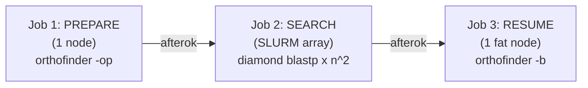
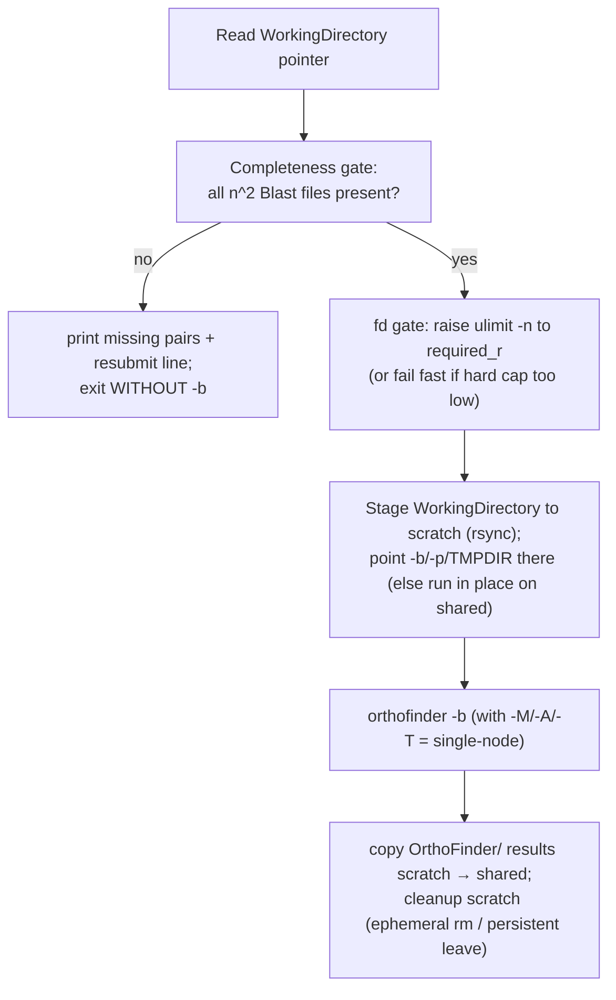

# Multi-node OrthoFinder — Resume Phase

This document describes **Job 3 of 3** in `convgeno`'s multi-node OrthoFinder
workflow: how the run is finished on a single fat node once the distributed
search is complete. It is a factual walkthrough of the workflow and the math, in
the order things actually happen. For the jobs that come before, see
[`1-prepare-phase.md`](./1-prepare-phase.md) and [`2-search-phase.md`](./2-search-phase.md).

---

## Where the resume phase sits

OrthoFinder's `-b` checkpoint resumes a run from already-computed search results
and performs the inherently **serial tail** of the analysis: MCL clustering →
multiple-sequence alignment → gene trees → species tree → orthologue and
duplication inference. None of these steps is parallel (they are
single-node bound, threaded by `-t`, and the orthologue step is RAM- and
file-descriptor-heavy), so this phase runs on **one fat node** — the opposite
resource profile from the many small search-array tasks.



The `afterok` dependency means resume runs **only if the whole search array
succeeded**. If any search task failed, resume never starts, and the chain halts
at the broken link (see [`2-search-phase.md`](./2-search-phase.md) for how to
diagnose and resubmit). Before doing any work, resume independently re-verifies
that the search set is complete (below), so an incomplete or corrupt search set
can never flow into the analysis.

Generated script: `slurm_scripts/orthofinder_resume.sh`
(from `convgeno.slurm.multinode_generator.generate_resume_script`).

---

## Inputs and outputs at a glance

**Inputs** (produced by prepare + search; `OUTPUT_PARENT` is the parent of
`orthofinder.output_dir`, `RUN_NAME` its basename):

| File / directory | Role |
|---|---|
| `<RUN_NAME>_working_dir_path.txt` | pointer to the `WorkingDirectory` |
| `WorkingDirectory/SpeciesIDs.txt` | species list (→ `n`, the expected pairs) |
| `WorkingDirectory/Species{i}.fa`, `diamondDBSpecies{j}.dmnd` | proteomes + DBs |
| `WorkingDirectory/Blast{i}_{j}.txt.gz` | the `n²` search results from Job 2 |
| `<RUN_NAME>_search_manifests/` | per-task manifests (used to map missing pairs → tasks) |

**Output:** the final OrthoFinder results directory under
`orthofinder.output_dir` (`Results_*/` with `Orthogroups/`, gene trees, the
species tree, and orthologue/duplication tables), landing on the **shared
filesystem** at the same path either way — written there directly when running in
place, or produced on scratch and rsynced back on success when staged (§5).

---

## Resources

Resume requests the **same resources as the single-node run** — the fat-node
profile `convgeno init` derived from cluster discovery: `--cpus-per-task` =
physical cores − 4, `--mem` = that CPU count × the partition's memory-per-CPU,
and `--time` = the user default (72 h). It passes the same OrthoFinder `-t`
(search/tree threads) and `-a` (analysis threads) as single-node. This parity is
deliberate: the resume tail is identical work in both the single-node and
multi-node paths, so it must be given identical resources.

---

## Step-by-step, in execution order



### 1. Resource request + environment

The SBATCH header carries the fat-node resources above; the conda bootstrap puts
`orthofinder`, `diamond`, and `python` on `PATH` (absolute paths embedded at
`init` time).

### 2. Locate the WorkingDirectory

The path is read from `<RUN_NAME>_working_dir_path.txt` (written by prepare); a
missing pointer means prepare failed, and the job aborts.

### 3. Completeness gate

Before touching anything, the job runs
`python -m convgeno.slurm.verify_search_complete`, which enumerates the `n²`
expected `Blast{i}_{j}.txt.gz` from `SpeciesIDs.txt` and checks each exists and
is non-empty. If any are missing it prints them, maps them back to the search
array task ids (by scanning the per-task manifests), prints a ready-to-paste
`sbatch --array=<ids> …` resubmit line, and **exits non-zero without running
`-b`** — the results are never touched. (Deeper `gzip` integrity is already
enforced upstream: the search array only skips a result that passes `gzip -t`,
and `afterok` lets resume start only when every search task succeeded, so this
gate is the belt-and-suspenders existence check for files that never landed.)

### 4. Open-file (fd) feasibility gate

OrthoFinder opens on the order of `n²` files at once during the orthologue step
(issue #571: 454 species needs r ≈ 206k). The job computes the requirement from
the species count `n`:

```
required_r = ceil(n² · 1.1) + 1024
```

reads the node's hard limit (`ulimit -Hn`), and then:

- if `required_r ≤ HARD` (or the hard cap is `unlimited`) → raises this shell's
  soft limit with `ulimit -n required_r` (the `orthofinder` child inherits it),
  keeping **full `-a`** — the fd fix is the raised limit, **not** fewer analysis
  threads;
- otherwise → **fails fast** with an actionable message (needs `NOFILE ≥
  required_r`; remedies: admin-raise NOFILE via `limits.conf` /
  `slurm.conf PropagateResourceLimits`, a higher-cap partition, or a container).

The prepare job runs the same check as a **pre-flight** (on a partition compute
node, before the long search), so an infeasible run is caught early. For this
project's regime (~114 species), `required_r ≈ 15,300` — comfortably under
typical HPC hard caps.

### 5. Scratch staging (the MSA stage runs on fast scratch)

The clean single-node run did **all** its per-orthogroup MSA/tree I/O on the fast
`/share/ceph/scratch` NVMe pool (its whole `WorkingDirectory` lived there);
running `-b` in place on the busier shared group pool instead produced transient
0-byte MAFFT alignments (the `list index out of range` warnings). Memory was ruled
out (`sacct`: both runs used <100 GB of a 342 GB request), leaving the filesystem
as the difference. So, mirroring the single-node and search-array scratch
mechanism, resume — when `slurm.scratch_dir` is set — **stages the whole
`WorkingDirectory`** (the `n²` `Blast{i}_{j}.txt.gz` + `Species*.fa` + IDs that the
search array consolidated onto shared) to scratch, points `-b`, `-p` and `TMPDIR`
there so every per-orthogroup read/write is node-fast, and on success **rsyncs the
produced `OrthoFinder/` results back to the shared `WorkingDirectory`** — so the
deliverable lands at the same shared path and downstream consumers are unchanged.
A SIGTERM/SIGINT/ERR salvage trap copies partial results back before the node is
lost. With no scratch configured — or none writable at runtime — it falls back to
running `-b` in place on shared. The completeness + fd gates always run on the
**shared** copy first (authoritative), never on the staged copy.

### 6. Run `orthofinder -b`

```
orthofinder -b "$WORK_DIR" -t <search_threads> -a <analysis_threads> \
    -p "$OF_TMP" -M msa -A <msa_program> -T <tree_program>
```

Run under `set +e` / `set -e` so the exit code is captured (not aborted) and the
cleanup below always runs. `-S` is **not** passed — the search program is already
fixed in the WorkingDirectory by prepare.

### 7. Cleanup

On success the produced `OrthoFinder/` results are copied scratch → shared, then
the scratch stage directory is removed (node-local/ephemeral scratch) **or left**
when it is persistent shared scratch (the cluster's purge policy reclaims it —
never `rm`'d, matching the single-node convention); with no scratch, the project
temp dir is removed. On failure the partial results are salvaged to shared and the
scratch/temp is preserved for debugging. The job exits with OrthoFinder's exit code.

---

## Scientific equivalence with single-node

The resume command emits `-M / -A / -T` **identically** to the single-node
command (from the same `orthofinder.msa_program` / `tree_program` config fields):
when an MSA program is set it uses `-M msa -A <aligner> -T <tree>` (defaults
`mafft` / `fasttree`), otherwise it omits them and OrthoFinder uses its
`dendroblast` default. Because the resume tail is the same single-node `-b` on
the same WorkingDirectory, and the search results are the same `n²`
`Blast{i}_{j}.txt.gz`, the multi-node run produces the **same Orthogroups and
gene/species trees** a single-node run would — which is what makes the
single-node benchmark a valid comparison.

---

## What the resume phase guarantees

- `-b` runs only against a **complete** search set (the completeness gate + the
  `afterok` dependency), never on missing or partial results.
- The run is **fd-feasible** — the open-file limit is raised to the `n²`
  requirement, or the job fails fast with guidance rather than dying with
  "too many open files" mid-run.
- The gene-tree method **matches single-node exactly**, so results are
  comparable.

## What runs next

Resume is the final job in the OrthoFinder orchestration; its Results directory
is the deliverable. Downstream pipeline steps (CAFE-5 / BadiRate turnover
modeling and the R association analysis) consume those results via files and are
outside this multi-node orchestration.
