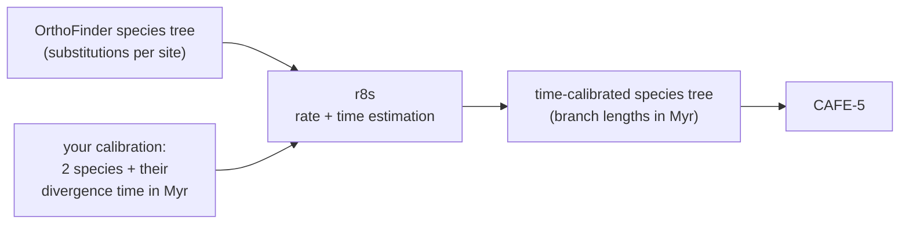

# The divergence-time parameter (r8s calibration)

This document describes the **one scientific parameter** the pipeline asks you
for when it converts your species tree into a time-calibrated tree: a pair of
species and the divergence time between them. It walks through exactly what your
two species names and one number are used for, so you can check the logic
against what you would do by hand.

For the OrthoFinder run that produces the tree this step consumes, see
[`../orthofinder/1-prepare-phase.md`](../orthofinder/1-prepare-phase.md).

---

## Why the pipeline needs it

OrthoFinder gives you `Species_Tree/SpeciesTree_rooted.txt`, and its branch
lengths are **expected substitutions per site** — genetic distance, not time. A
long branch there can mean either "a lot of time passed" or "this lineage evolved
fast", and the tree does not distinguish the two.

CAFE-5 cannot use that tree. It requires a rooted, strictly binary,
**ultrametric time tree**: every path from the root to a tip is the same length,
and those lengths are in real time units. CAFE-5's documentation is explicit that
a tree which is ultrametric but whose lengths are in substitutions or coalescent
units produces uninterpretable results, because the gene gain/loss rate (λ) it
estimates is a rate *per unit of branch length*. Feed it substitutions and λ
comes out per substitution, which is not a biologically meaningful rate.

The pipeline closes that gap with **r8s 1.81**, run automatically at the end of a
successful OrthoFinder run. r8s estimates a substitution rate for every branch
and divides each branch's genetic distance by its rate to get a duration — but
durations alone have no scale until at least one node in the tree is pinned to a
known age. **That is the number you supply.**



---

## What you provide

Setup asks for the calibration during `convgeno init`:

```
=== Species tree calibration (r8s ultrametric step) ===
r8s scales the OrthoFinder species tree to time from ONE calibration:
two species and their divergence time in millions of years. Name each
species EXACTLY as its proteome file basename (no extension), e.g.
'Homo_sapiens'.
  12 proteome species found in Data/interim/proteomes_filtered.
First calibration species (press Enter to skip): Homo_sapiens
Second calibration species: Felis_catus
Divergence time between them (millions of years): 94
  Calibration set: MRCA(Homo_sapiens, Felis_catus) = 94 Myr.
```

Three values, and the rules applied to each.

### The two species names

- They must be **two species that are in your data** — two of the proteomes you
  gave OrthoFinder. The pipeline cannot calibrate against a species that is not
  in the tree.
- Write each name **exactly as its FASTA file's basename with the extension
  removed**: `Homo_sapiens.fa` → `Homo_sapiens`, `Felis_catus.faa` →
  `Felis_catus`. OrthoFinder
  labels each tip of the species tree with the input filename, so the FASTA
  basename *is* the name r8s has to find in the tree. Recognised extensions are
  `.fa`, `.fasta`, and `.faa`.
- Names may contain letters, digits, `.`, `_`, and `-`. Other characters
  (including spaces, `:` and `,`) are rejected at the prompt.
- The two species must be different from each other; the prompt asks again if
  they are the same.
- **Names are checked as you type them, when possible.** If your filtered-
  proteome directory already exists, setup reads the species names out of it and
  rejects anything that is not one of them, showing you examples of the names it
  did find. If you run setup before preparing the proteomes, any well-formed name
  is accepted and the check happens at run time instead: the step then stops with
  an error listing every actual tip label in the tree, so a typo or a leftover
  extension is immediately obvious.

### The divergence time

- Any positive number; the prompt asks again for zero, negatives, or non-numbers.
- **Give it in millions of years.** The number is used exactly as you type it, in
  whatever unit it represents — no conversion is applied. Myr is what the prompts
  assume and what makes CAFE-5's λ comparable to published per-Myr rates.
- Use a published date for that split: a fossil-calibrated estimate from the
  literature, or a database such as TimeTree. A point estimate is what setup
  collects; if you would rather give a confidence interval, see
  [Using more than one calibration](#using-more-than-one-calibration) below.

Your answers are recorded in `pipeline_config.yaml`:

```yaml
ultrametric:
  species_a: Homo_sapiens
  species_b: Felis_catus
  divergence_my: 94.0
```

Everything after this point is automatic. The calibration is carried into the
generated OrthoFinder job scripts, so the time-calibrated tree is produced by the
same job that builds the species tree — you do not run a separate command.

---

## What your two species actually calibrate

r8s dates **nodes**, not species. Your species pair is how you point at a node:
the pipeline calibrates the **most recent common ancestor (MRCA)** of the two
species you named, and fixes that node's age to your number.

```
Homo_sapiens ─┐
              ├─ this node is fixed at 94 Myr
Felis_catus  ─┘
```

Two consequences worth internalising before you choose a pair:

- **Any pair with the same common ancestor is equivalent.** If you have a date
  for the human/cat split, human + cat, human + dog, and mouse + cat may all
  resolve to the same ancestral node depending on your tree's topology — pick
  whichever pair you have the cleanest published date for.
- **The pair determines which node gets pinned, so pick the pair whose common
  ancestor is the divergence your number refers to.** A human/cat pair pins a
  deep placental split; a human/chimp pair pins a very shallow one. 

The single fixed node sets the scale for **everything else**. All other node ages
are estimated from the branch lengths and the rate model, then the whole tree is
scaled so that your calibrated node lands exactly on the age you gave. A deeper
calibration therefore constrains a longer stretch of the tree; a very shallow one
extrapolates further to reach the root.

---

## How the tree is scaled to time

The step runs in this order.

**1. It finds your species tree and its alignment.** Both come from the
OrthoFinder results directory, whether the run was single-node or multi-node.

**2. It determines the number of sites.** r8s must know how much sequence
produced the substitutions-per-site branch lengths, because the same branch
length is far stronger evidence when it comes from 300,000 columns than from 300.
The pipeline reads this from the concatenated species-tree alignment OrthoFinder
built and uses the **number of alignment columns** — the width of the alignment,
including gaps. It verifies every sequence in the file has that same width and
stops with an error if the file is not a proper alignment, rather than proceeding
with a plausible-looking wrong number.

This is derived automatically; you are not asked for it. You can override it in
`pipeline_config.yaml` (`ultrametric.nsites`) if you have a reason to.

> The alignment only exists if OrthoFinder ran in MSA mode. If it is missing, the
> step stops and says so explicitly — see
> [Troubleshooting](#troubleshooting).

**3. It confirms your species are in the tree.** Both names are matched against
the tree's tip labels *before* r8s is invoked, so a naming mistake fails fast
with the real tip labels printed, instead of producing a subtly wrong tree.

**4. It cleans the tree for r8s.** OrthoFinder's species tree carries branch
support values on internal nodes, which r8s cannot read. These annotations are
removed. **Topology, tip labels, and every branch length are preserved
unchanged** — nothing about the phylogenetic or substitution-length information
is altered.

**5. It builds the r8s instructions and runs them.** The resulting file is saved
alongside your results so you can read exactly what r8s was asked to do:

```
#NEXUS
begin trees;
tree nj_tree = [&R] ((Homo_sapiens:0.04021,Felis_catus:0.05130):0.01887,…);
End;
begin rates;
blformat nsites=283789 lengths=persite ultrametric=no;
collapse;
mrca Homo_sapiens_Felis_catus Homo_sapiens Felis_catus;
fixage taxon=Homo_sapiens_Felis_catus age=94;
set smoothing=100;
divtime method=pl algorithm=tn;
describe plot=chronogram;
describe plot=tree_description;
end;
```

**Penalized likelihood** allows the substitution rate to vary between branches,
but penalises rate changes from one branch to the next, so the fit stays close to
a clock unless the data clearly demand otherwise. The `smoothing` value is the
strength of that penalty: **higher smoothing means closer to a strict molecular
clock**. The pipeline uses `100` by default and it is adjustable in
`pipeline_config.yaml` (`ultrametric.smoothing`).

r8s then solves for all node ages at once and scales them so your calibrated node
sits at 94. Every tip ends up the same distance from the root, and every branch
length in the output is a **duration in your time unit**.

**6. It extracts the dated tree and checks it.** The pipeline pulls the dated
tree out of r8s's output and re-checks the file it wrote: rooted, strictly
binary, and ultrametric. "Ultrametric" is tested by comparing the shortest and
longest root-to-tip paths and requiring them to agree to within 0.1% of tree
height, so the check works the same whether your ages are in Myr or relative
units. On success you see:

```
post-validation: tree is rooted, binary, and ultrametric.
```

Anything short of that is printed as an explicit warning rather than passed
silently downstream.

---

## What you get

At the end of the OrthoFinder job, in its output directory:

| File | Contents |
|---|---|
| `species_tree_ultrametric.nwk` | **the time-calibrated species tree** — the tree CAFE-5 consumes |
| `r8s_work/r8s_ctl_file.txt` | the exact instructions r8s was given, including your calibration |
| `r8s_work/r8s_tmp.txt` | r8s's full output, including its chronogram plot |

The last two are kept deliberately: they are what you inspect to confirm your
calibration was applied the way you intended, and to read off the inferred ages
of the other nodes.

The run also prints a summary:

```
nsites:        283789
calibrations:  1
tips (12):     Bos_taurus, Canis_familiaris, Felis_catus, Homo_sapiens, …
dating:        pl (fixed smoothing=100)
control file:  …/r8s_work/r8s_ctl_file.txt
ultrametric tree -> …/species_tree_ultrametric.nwk
post-validation: tree is rooted, binary, and ultrametric.
```

This step never jeopardises your OrthoFinder results. It runs after OrthoFinder
has already succeeded, and if it fails — or if r8s is not installed on the
cluster — it reports that and leaves the job successful. r8s is not available
through conda; build it once with the instructions in
[`tools/r8s/README.md`](../../tools/r8s/README.md) and the step starts working on
your next run, with no change to the calibration you already set.

---

## If you skip the calibration

Pressing Enter at the first species prompt skips it, and setup tells you what
that means:

```
  No calibration set: the tree will be made ultrametric in RELATIVE
  time (root-anchored). Re-run 'convgeno init' to add one later.
```

The step still runs, and still produces an ultrametric tree — but with no
external date to anchor it, **the pipeline anchors the root of the tree at an age
of 1** and reports doing so. It picks two species that sit on opposite sides of
the root split (so their common ancestor is the root itself) and fixes that node
at 1 instead of at a real date. Everything else proceeds identically.

What that gives you, stated plainly:

- **The topology and the proportions of the tree are unaffected.** Node ages come
  out as fractions of total tree height: a node reported at `0.25` is a quarter
  of the way from the root to the tips. **Relative** divergence times remain
  meaningful, and the tree is genuinely ultrametric, so CAFE-5 will accept it and
  run.
- **The time axis is not real.** Ages are in units of "one root age", not
  millions of years. They cannot be compared with fossil dates, with published
  divergence times, or with the tree from another run.
- **CAFE-5's λ changes meaning along with it.** Because λ is a rate per unit of
  branch length, on a root-age-1 tree λ is expressed per relative tree height
  rather than per Myr. It remains usable for comparing rate classes *within* that
  run — for example the multi-λ analysis, which asks whether some branches evolve
  faster than others — but its absolute magnitude is not comparable to published
  per-Myr λ values, and neither are inferred ages of gene family expansions.

A relative-time tree is never silently mistaken for a calibrated one: the log
warns and names the two species used as the root anchor, the run summary prints
`calibrations: none (relative-time, root-anchored)`, and the recorded run
statistics mark it as relative time.

You can set a different anchor age with `ultrametric.root_age` in
`pipeline_config.yaml` if you want a different relative scale — but if you want
real time, supply a real calibration. Re-running `convgeno init` adds one, and no
OrthoFinder work has to be repeated to apply it: the calibration only affects
this final scaling step.

---

## Using more than one calibration

Setup collects one calibration because that is the minimum needed to set a
timescale. If you have several published dates, or you would rather give an age
range than a point estimate, `pipeline_config.yaml` accepts a list — the
behaviour described above is unchanged, there are simply more pinned nodes:

```yaml
ultrametric:
  nsites: auto              # auto = read the column count from the alignment
  calibrations:
    # Fixed age: this node is pinned at exactly 94 Myr.
    - name: humancat
      taxa: [Homo_sapiens, Felis_catus]
      age: 94
    # Age window: this node is only required to fall between 100 and 120 Myr.
    - name: rootnode
      taxa: [Homo_sapiens, Mus_musculus]
      min_age: 100
      max_age: 120
  smoothing: 100            # higher = closer to a strict molecular clock
  cross_validate: false
  output: Data/interim/cafe_input/species_tree_ultrametric.nwk
```

- `taxa` follows the same rule as the prompts: two species in your data, named as
  their FASTA basenames.
- Use `age` for a point estimate, or `min_age`/`max_age` for a window (either
  bound may be given alone for a one-sided constraint). Windows let r8s place the
  node wherever the data prefer inside your confidence interval, instead of
  forcing it onto a single value.
- Multiple calibrations constrain the tree in more places and are generally
  preferable to one when reliable dates exist. At least one of them must give a
  fixed age or a fully bounded window, otherwise there is nothing to set an
  absolute scale from and the run warns that r8s may be unable to date the tree.
- `cross_validate: true` asks r8s to choose the smoothing value from the data
  instead of using the fixed one. It is more rigorous, but it re-optimises the
  whole tree once per species per candidate smoothing value, so its cost grows
  with the number of species — practical for small trees, not for genome-scale
  ones. It is off by default for that reason.

Multiple calibrations are read from the config file rather than collected by the
setup prompts, so add them there and re-run the ultrametric step.

---

## Troubleshooting

| What you see | What it means |
|---|---|
| `Calibration taxa not found as tips in SpeciesTree_rooted.txt: [...]` followed by the real tip labels | A species name does not match a proteome basename — usually an extension left on, a spelling difference, or a species not in this run. Copy a name from the printed list. |
| `Concatenated species-tree alignment not found` | OrthoFinder ran without MSA mode, so there is no alignment to count sites from. Re-run OrthoFinder in MSA mode, or set `ultrametric.nsites` to a known value. |
| `Alignment is not rectangular` | The species-tree alignment file is truncated or was overwritten; the OrthoFinder run needs re-checking. |
| `r8s not installed; ultrametric step skipped.` | Expected until r8s is built — see [`tools/r8s/README.md`](../../tools/r8s/README.md). Your OrthoFinder results are complete and unaffected. |
| `post-validation WARNINGS: … tree is not ultrametric within tolerance` | r8s returned a tree that does not date cleanly. Read `r8s_work/r8s_tmp.txt`: usually the calibration is placed on an implausible node, or the tree has too little signal to date at the chosen smoothing. |
| `No calibration provides a fixed age or a bounded (min+max) window` | Every calibration is one-sided, so nothing pins the scale. Give at least one `age`, or both `min_age` and `max_age`. |

---

## What the pipeline guarantees

By the time this step reports success:

1. The number of sites given to r8s is the column count of the very alignment
   that produced the branch lengths, verified to be a real alignment.
2. Every calibration species is a genuine tip in your species tree, checked by
   name before r8s runs, with the actual tip labels reported if not.
3. The tree given to r8s has the same topology, tip labels, and branch lengths as
   OrthoFinder produced — only unreadable support annotations were removed.
4. The tree written out has been re-checked as rooted, binary, and ultrametric,
   with any failure surfaced as a warning rather than passed downstream.
5. The exact instructions r8s received, and its full output, are saved next to
   the tree for inspection.
6. A calibrated tree and a relative-time tree are always distinguishable — in the
   log, in the printed summary, and in the recorded run statistics.

